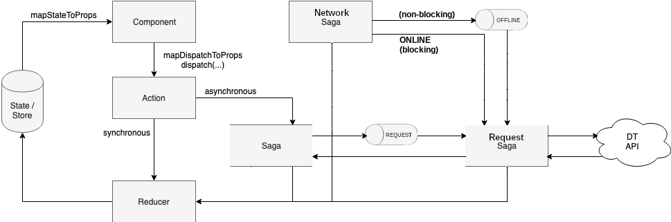

# Data Store #

The data store uses the [Redux](https://redux.js.org/) state container to manage data within the app.

Additions to the basic Redux setup include:

* [Redux Persist](https://github.com/rt2zz/redux-persist) - Automatically persists the data store to local storage so as to save the state between sessions and assist in allowing offline usage.
* [Redux Saga](https://redux-saga.js.org/) - Redux middleware to assist in the execution of asynchronous tasks like API calls

## Directory Structure ##

This `/store` directory is setup with the following structure:

* `actions/` - Redux action creators and constants grouped together by their root state property name (e.g. `users` and `contacts`)
* `sagas/` - Redux sagas grouped together by their root state property name. Sagas handle async actions and will dispatch the appropriate actions based on success/failure conditions.
* `reducers/` - Redux reducers that directly transform the state.
* `sagas.js` - Root saga that joins together the individual sagas.
* `reducer.js` - Root reducer that joins together the individual reducers.
* `store.js` - Initialization of the app data store to be included in the root of the app

## Accessing Data in Components/Screens ##

The structure of the data can be seen in `reducers/` by looking at the `initialState` constant of each reducer.

In order to access data from the store within a Component or Screen, there are a few things to add to the component.

### `connect` Component Wrapper ###

Include the `connect` function with `import { connect } from 'react-redux';`.

Instead of exporting the component in the normal way of:
```
export default MyComponent
```

...use the `connect` function to wrap it like: 
```
export default connect(mapStateToProps, mapDispatchToProps)(MyComponent)
``` 

*See below for description of the two function parameters*

### `mapStateToProps` to fetch data from store ###

In order to sync data from the store into the props of our component so that we can access them, we use the first parameter of the `connect` function to define which data we need and how we want to expose it within our component.

```javascript
const mapStateToProps = state => ({
  contacts: state.contacts.items,
  user: state.user,
});
export default connect(mapStateToProps, mapDispatchToProps)(MyComponent);
```

In this case, we will pull in `state.contacts.items` (the array of contacts) into a prop named `contacts`. This exposes it in the component using `this.props.contacts`. Likewise, we are exposing `state.user` via `this.props.user`.

### `mapDispatchToProps` to execute store actions ###

In order to dispatch actions that will update data in the store, we use the `mapDispatchToProps` parameter of `connect`.

```javascript
import { getAll as getAllContacts } from '../store/actions/contacts.actions';
...
const mapDispatchToProps = dispatch => ({
  getContacts: (domain, token) => {
    dispatch(getAllContacts(domain, token));
  },
});
export default connect(mapStateToProps, mapDispatchToProps)(MyComponent);
```

The above creates the function `this.props.getContacts(domain, token)` to be used anywhere in that component. This action will fetch all contacts from the DT API and push them into the state (`state.contacts.items`) so that they are then available through the mapped prop above `this.props.contacts`. 

## Data Flow ##

Using the Redux pattern, data flows in a single direction around a loop:

`State` --> `Component/View` --> `Actions` --> `Reducer` --> `State`

Since we are doing both synchronous and asynchronous changes to the state, there are two different ways that updates happen between actions and reducers.



### Synchronous Data ###
Synchronous data follows the basic pattern of Redux:

1. Component dispatches an action:
   E.g.
   ```javascript
   dispatch(logout())
   ```
1. Action creator creates the action to be handled by reducer:
   ```javascript
   export function logout() {
     return { type: USER_LOGOUT };
   }
   ```
1. Reducer looks for action type and updates the store appropriately:
   ```javascript
   switch (action.type) {
     ...
     case userActions.USER_LOGOUT:
       return Object.assign({}, state, {
         token: null,
       });
     default:
       return state;
   }
   ```
   
### Asynchronous Data ###
Asynchronous data updates are those that will wait for a response from an external service, most often through APIs. All API requests to DT within this app would follow this pattern.

1. Component dispatches an action:
   E.g.
   ```javascript
   dispatch(login(domain, username, password));
   ```
1. Action creator creates the action to be handled by **saga**:
   ```javascript
   export function login(domain, username, password) {
     return {
       type: USER_LOGIN,
       domain,
       username,
       password,
     };
   }
   ```
1. Saga watches for actions of given type and intercepts them before they go to the reducer:
   ```javascript
   export default function* userSaga() {
     yield all([
       takeLatest(actions.USER_LOGIN, login),
     ]);
   }
   ```
1. Saga intercepts action and executes async code using [ES6 generators](https://goshakkk.name/javascript-generators-understanding-sample-use-cases/):
   ```javascript
    export function* login({ domain, username, password }) {
      yield put({ type: actions.USER_LOGIN_START });

      // fetch JWT token
      yield put({
        type: 'REQUEST',
        payload: {
          url: `http://${domain}/wp-json/jwt-auth/v1/token`,
          data: {
            method: 'POST',
            headers: {
              'Content-Type': 'application/json',
            },
            body: JSON.stringify({
              username,
              password,
            }),
          },
          action: actions.USER_LOGIN_RESPONSE
        },
      });

      // handle response
      try {
        const res = yield take(actions.USER_LOGIN_RESPONSE)
        if (res) {
          response = res.payload;
          jsonData = yield response.json();
          if (response.status === 200) {
            yield put({ type: actions.USER_LOGIN_SUCCESS, domain, user: jsonData });
          } else {
            yield put({ type: actions.USER_LOGIN_FAILURE, error: { code: jsonData.code, message: jsonData.message } });
          }
        }
      } catch (error) {
        yield put({ type: actions.USER_LOGIN_FAILURE, error: { code: '400', message: '(400) Unable to process the request. Please try again later.' } });
      }
    }
   ```
   1. At the start of a request, we dispatch (or `put`) action to update the state that we are loading data.
   1. Next, we dispatch (or `put`) our payload onto the `REQUEST` actionChannel. Notice that we are specifying an *action* property in the payload; this is so that the Request Saga can return control/response to us when it's available.  Also when this payload is dispatched to the `REQUEST` actionChannel, the requestReducer state will also be updated to queue this new request
   1. Handle eventual response (optional):
      - On success, we dispatch success action. 
      - On failure, we dispatch failure action. 
1. Request Saga will `fork` and process the previous Saga (if ONLINE), otherwise (if OFFLINE) it will queue requests and wait (block) to come back ONLINE, and only then continue processing (adapted from: https://www.youtube.com/watch?v=Pg7LgW3TL7A and https://redux-saga.js.org/docs/advanced/Channels.html ). We continually `race` between taking from the `OFFLINE` channel and the `REQUEST` channel:  
    - if we take the `OFFLINE` channel, then block (requests continue to queue) until we `take` from `ONLINE` at some future time, otherwise... 
    - if we take from the `REQUEST` channel, then `select` requestReducer state (an array of requests) and ensure that the request is still present (it may have been removed due to another offline edit, etc...); if the request is still present, then go ahead and `fork` it to be processed:
   ```javascript
    export default function* requestSaga() {
      // buffer all incoming requests
      const reqChannel = yield actionChannel('REQUEST')
      const offlineChannel = yield actionChannel('OFFLINE') 

      // enqueue when offline, fork when online
      while (true) {
        const { offline, payload } = yield race({
          offline: take(offlineChannel), 
          payload: take(reqChannel)
        })
        if (offline) {
          // block until we come back online
          yield take('ONLINE')
        } else {
          /* 
          NOTE: compare actionChannel request with requests in requestReducer state.
          if the request is present in the requestReducer state, then fork it, otherwise skip it 
          */
          const reqState = yield select(state => state.requestReducer)
          for (let req of reqState) {
            if (req === payload) {
              // process the request
              yield fork(processRequest, payload)
            } 
          }
        }
      }
    }
   ```
    - A forked request is then processed via [Fetch](https://developer.mozilla.org/en-US/docs/Web/API/Fetch_API), and we have another `race` to ensure that a response is received prior to a specified timeout.  Assuming that our request is successful, then we check whether the payload contained an `action` and dispatch (or `put`) the response to be handled by the saga which dispatched the original request (e.g., `user.sagas.js`). The response is also dispatched (or `put`) to the `RESPONSE` queue in order to remove the request from the state queue. Since we are queueing up requests that we want to be sent, when we do successfully send a request then we also want to dequeue that same request.
   ```javascript
    function* processRequest(req) {
      // race 'fetch' against a timeout
      const { timeout, res } = yield race({
        res: call(fetch, req.payload.url, req.payload.data),
        timeout: delay(REQUEST_TIMEOUT_MILLIS)
      });
      if (res) {
        if (req.payload.action) {
          yield put({ type: req.payload.action, payload: res })
        }
        yield put({ type: 'RESPONSE', payload: { req, res } })
      }
      if (timeout) {
        yield put({ type: 'OFFLINE' });
      }
    }
   ```
1. Reducer looks for action type and updates the store appropriately:
   ```javascript
    export default function userReducer(state = initialState, action) {
     switch (action.type) {
       case userActions.USER_LOGIN_START:
         return Object.assign({}, state, {
           isLoading: true,
           error: null,
         });
       case userActions.USER_LOGIN_SUCCESS:
         return Object.assign({}, state, {
           isLoading: false,
           domain: action.domain,
           token: action.user.token,
           username: action.user.user_nicename,
           displayName: action.user.user_display_name,
           email: action.user.user_email,
         });
       case userActions.USER_LOGIN_FAILURE:
         return Object.assign({}, state, {
           isLoading: false,
           error: action.error,
         });
       ...
       default:
         return state;
     }
    }
   ```
   - The `requestReducer` is kind of a special case where we are only concerned with queueing new requests to the state queue, and filter/removing requests when a successful response has been received. (There is also some logic for properly handling offline create and edit, but that is not displayed here).
  ```javascript
    export default function requestReducer(state = [], action) {
      switch (action.type) {
        case actions.REQUEST:
          ...
          // add the new request to the state queue
          return [...state, action]
        case actions.RESPONSE:
          // loop through every item in local storage and filter out the successful request
          return state.filter(existing => existing.req === action.payload.req)
        default:
          return state
      }
    }
  ```
